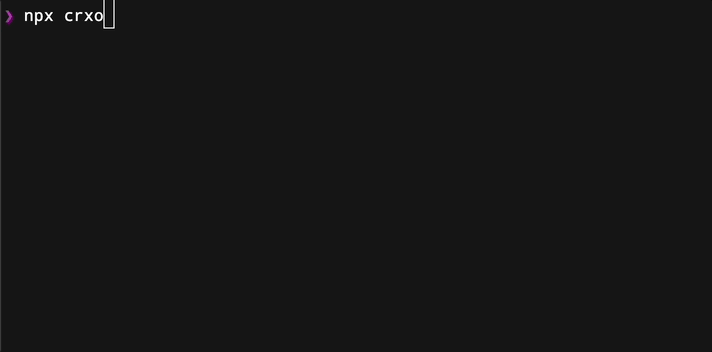

<h1 align="center">🧳 CRXO - Create React Component CLI</h1>

Save huge amount of time by using CLI to create your react components.

automate your component creation process and focus on developing high-quality React components for your projects.

---

# About

As a developer, you may find yourself frequently creating new React components for your projects. This process can often be repetitive and time-consuming, particularly when you need to generate files for additional features like utility functions, type definitions, or different styling options.

To streamline this process and improve your workflow, I've developed a CLI tool that allows you to quickly generate new React components with a range of customizable options. Our tool supports three different styling options, including CSS, CSS Modules, and SCSS Modules. Additionally, you can choose to generate your components in either JavaScript or TypeScript.

This tool includes built-in support for generating utility functions and type definitions for your components, helping you to work more efficiently and avoid repetitive tasks. You can easily include or exclude these additional files when generating your component.

---

# Example

you can view `examples` folder for more real files examples.

---

# How to use CRXO?

To use the tool, simply run the CLI command with the appropriate options. 

For example, to generate a new React component with CSS styling and TypeScript code, you can install it locally or globally, or just use it with "npx crxo" command without any installations required.

* Global installation: npm i -g crxo / yarn global add crxo
* Local installation: npm i crxo --save-dev / yarn add crxo -D
* npx (no installation): npx crxo

---

### NPM Package

https://www.npmjs.com/package/crxo

### Contribute
https://github.com/ItzikGabay/react-create-component-cli

### Author:

<a href="https://github.com/ItzikGabay">Itzik Gabay</a>

